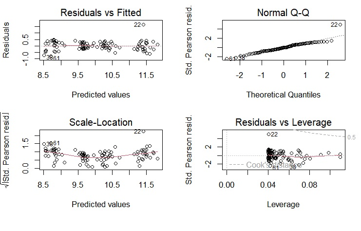

```{r, include = FALSE}
knitr::opts_chunk$set(
  collapse = TRUE,
  comment = "#>"
)
```
{width=70%}

Este paquete contiene funciones útiles para el análisis de datos, principalmente para modelos lineales (LM, GLM, GLMM). Aunque está pensado para usarse en Ciencias Biológicas, su aplicación se extiende a cualquier área del conocimiento que requiera análisis estadísticos. Es una compilación de funciones útiles creadas por mi o por alguien más, que facilitan el análisis de datos: exploración y transformaciones de datos, revisión de los supuestos de los modelos lineales (LM, LMM, GLM, GLMM), exportación de tablas, entre otros.

Para más información sobre el paquete y actualizaciones, visita la página:
[https://mariosandovalmx.github.io/tlamatini-website/](https://mariosandovalmx.github.io/tlamatini-website/)


Si quieres conocer más de mi trabajo, visita mi pagina web:
[https://mariosandovalmx.github.io/ecology/](https://mariosandovalmx.github.io/ecology/)


Para este ejemplo sobre como usar Tlamatini, vamos a usar una base ded datos que contiene la longitud hocico-cloaca de lagartijas de la especie *Sceloporus torquatus* en cuatro localidades distintas, que vamos a llamar A, B, C y D. Además contiene la velocidad de desplazamiento y el tiempo de reacción de cada lagartija.

La base de datos se puede descargar del siguiente enlace:
[descargar datos](https://github.com/mariosandovalmx/examples-data/blob/53d82952ea60a25611d99dd6a7c0e6510d5bac7d/datos.GLM1.csv)

Vamos a cargar la base de datos:

```{r}
df <- read.csv("https://raw.githubusercontent.com/mariosandovalmx/examples-data/main/datos.GLM1.csv", header=TRUE)
```

##Exploración de datos
Así luce nuestra base de datos:

```{r}
head(df)

```

Para este ejemplo vamos a comenzar cargando la paqueteria.
```{r setup}
library(tlamatini)
```
Vamos a comenzar a convertir todas las variables categoricas a factor. Esta función nos va a reconocer todas las variables que son tipo caracter y las va a codificar como factor. Nota: no funciona si la columna es numérica.

```{r}
df<- as_factorALL(df)

```


Vamos a explorar si hay datos faltantes en las variables numéricas, tambien vemos la media, el mínimo y máximo de cada variable, además de otros parámetros.

```{r}
numSummary(df)
```

También podemos explorar las variables categóricas:
```{r}
charSummary(df)
```

¡No hay datos faltantes en las variables!

También nos interesa saber cómo se relacionan las variables explicativas con nuestra variable de respuesta, en este caso la longitud hocico cloaca. Para ello usamos la función *ggpairs_dfnum*, que nos da el valor de correlación y el valor de p. Como vemos en la gráfica, la velocidad de desplazamiento de las lagartijas se correlaciona negativamente con la longitud hocico cloaca. También vemos que el tiempo de reacción se correlaciona negativamente con la LHC.
```{r fig.height = 3, fig.width = 6}
ggpairs_dfnum(df, var.response = "LHC")
```

Ahora vamos a graficar la LHC por Localidad, para ello usaremos la paquetería *ggpubr*:
```{r fig.height = 3, fig.width = 6}
library(ggpubr)
 ggboxplot(df, "Localidad", "LHC",
    color = "Localidad", palette =c("#00AFBB", "#E7B800", "#FC4E07", "darkblue"),
    add = "jitter", fill = "Localidad", alpha= 0.5)
```
Y si quisiéramos saber que si nuestra variable de respuesta sigue una distribución normal podemos hacer un histograma de frecuencias. Para ello usamos la función *hist_curva*.
```{r fig.height = 3, fig.width = 6}
hist_curva(df$LHC)

```
Lo podemos ver más claramente en el histograma de frecuencuas y en el qqplot. La prueba de Kolmogorov-Smirnov indica que no la distribución es parecida a la normal. Además nos dice que hay dos datos extremos, el 22 y 38.


Podemos ajustar un modelo lineal generalizado (GLM). Con esta base de datos vamos a ajustar dos modelos lineales generalizados, el primero con la distribución gaussiana y logaritmo como función de liga. El segundo con distribución gaussiana y función de liga identity. Usaremos la longitud hocico-cloaca (LHC) como variable de respuesta. Además, usaremos la variable Velocidad y Localidad como variables explicativas.

```{r}
modelo  <- glm(LHC ~ Velocidad  + Localidad, family = gaussian("log"), data= df)
modelo2 <- glm(LHC ~ Velocidad  + Localidad, family = gaussian("identity"), data= df)
AIC(modelo, modelo2)
```
De acuerdo con el Criterio de información de Akaike, el modelo 2 es mejor. Vamos a ver el summary del modelo:

```{r}
summary(modelo2)
```


La velocidad es significativa p<0.001, al igual que los niveles del factor Localidad.

Vamos a revisar el ajuste del modelo. Esto lo podemos hacer con la función *resid_glm*.

`resid_glm(modelo3)`



En la primera gráfica, la línea roja es horizontal y aplanada sobre la línea punteada, indica buen ajuste, homocedasticidad. El QQPlot se ve bien, la mayoría de los puntos se ajustan a la línea punteada, lo cual indica que los residuales se aproximan a la distribución normal.

Y otra forma de explorar los residuales del modelo es usando la función *resid_DHARMa*, que muestra la normalidad, la dispersión y los outliers. En la segunda gráfica se muestra la homocedasticidad:

```{r fig.height = 4, fig.width = 8}
resid_DHARMa(modelo2)
```
Parece que hay dos posibles outliers. Vamos a comprobarlo:


```{r fig.height = 3, fig.width = 6}
outliers.plot(modelo2)
```
El dato que se encuentra en la fila 22 es un outlier.
Según esta función, el dato que se encuentra en la fila 22  tiene un valor de std.resid mayor a 3, y el valor de p con ajuste de Bonferroni es < 0.05, lo que nos indica que puede ser un dato influyente y tenemos que revisar esta observación. Tendremos que corroborar que esta observación es correcta y no cometimos nungún error al capturar nuestros datos. Vamos a suponer que fue un error de medición y no podemos confiar en este dato, y no hay forma de repetir la medición. Así que lo vamos a remover y volver a ajustar el modelo:

```{r}
library(dplyr)
df2 <- slice(df, -c(22))
modelo3 <- glm(LHC ~ Velocidad  + Localidad, family = gaussian("identity"), data= df2)
summary(modelo3)

```
En el modelo sigue siendo significativa la variable Velocidad.

Revisamos los residuales de este nuevo modelo…


```{r fig.height = 4, fig.width = 8}
resid_DHARMa(modelo3)
```


Comprobamos si aún tenemos outliers en el nuevo modelo:
```{r fig.height = 3, fig.width = 6}
outliers.plot(modelo3)
```
Ya no tenemos outliers, lo ideal es remover el menor número posible de observaciones. El modelo tiene buen ajuste. 

Ambas variables Velocidad y Localidad son significativas en el modelo. El ANOVA tipo III sirve para examinar la importancia de cada efecto parcial, es decir, la importancia de un efecto con todos los demás efectos del modelo. Y vamos a graficar los efectos del modelo:

```{r fig.height = 3, fig.width = 6}
plot_effects(modelo3)
```
o bien:


```{r fig.height = 3, fig.width = 5}
plot_effects2(modelo3)
```

Los efectos también los podemos graficar usando la paquetería *ggeffects*.
```{r fig.height = 3, fig.width = 6}
library(ggeffects)
dat <- ggeffect(modelo3, terms = c("Velocidad"))
plot(dat)
```
Podemos usar los diferentes temas predefinidos para artículo científico o para presentación.
```{r}
pl <- plot(dat)
pl + tema_articulo()
#pl + tema_articulo(14,14)
#pl + tema_articulo2()
#pl + tema_presentacion()
```


Ahora vamos a obtener la tabla de ANOVA tipo III, los contrastes post-hoc Tukey y la tabla del modelo. De esta forma podremos copiar las tablas y pegarlas directamente en nuestro documento de Word. Primero vamos a obtener la tabla de ANOVA tipo III:
```{r}
table_ANOVA3(modelo3)
```

Ahora vamos a obtener los contrastes post-hoc Tuckey, usamos la paquetería *emmeans*. Primero se muestran las medias, error estandar y los intervalos de confianza. Luego se muestran los contrastes entre localidades, con el valor del estadistico y el valor de p:

```{r}
library(emmeans)
cont1 <- emmeans(modelo3, pairwise ~ Localidad,adjust="tukey",type="response")$contrasts
table_contrasts(cont1)
```

Y finalmente vamos a obtener la tabla del modelo.


